# Kong API Gateway Architecture Diagrams

## 1. High-Level Kong Architecture

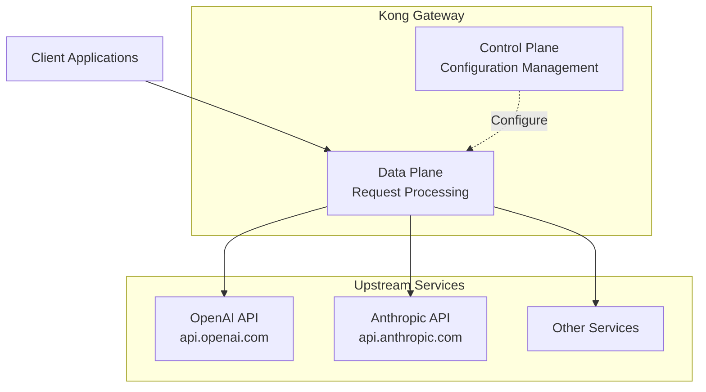

## 2. Your Current Kong Setup

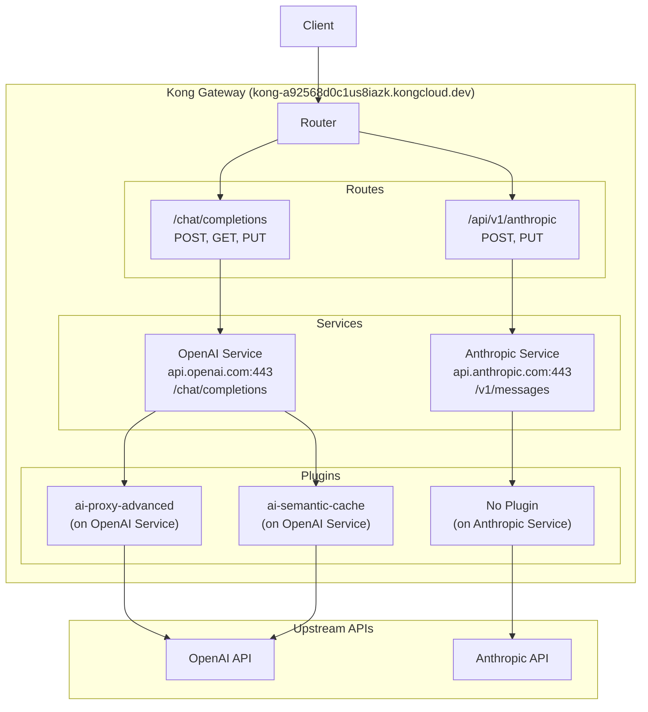

## 3. Request Flow Diagram

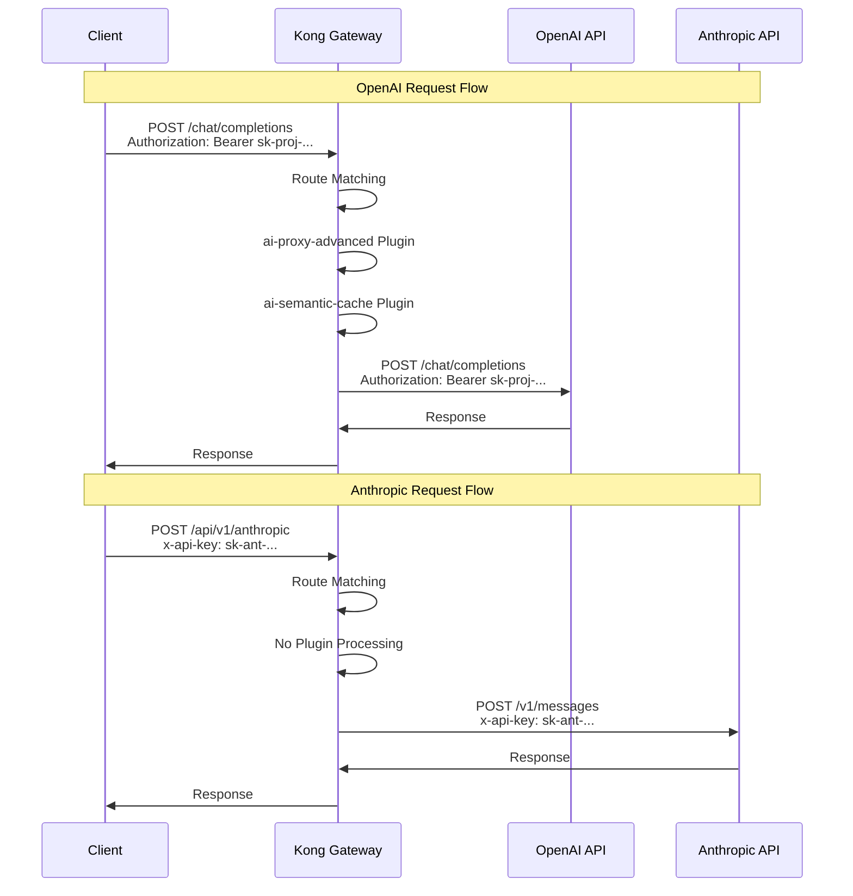

## 4. Plugin Architecture

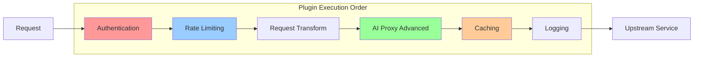

## 5. Authentication Flow Comparison

```mermaid
graph TB
    subgraph "Current Setup (Insecure)"
        Client1[Client]
        Kong1[Kong Gateway]
        Upstream1[Upstream API]
        
        Client1 -->|"API Key exposed<br/>in request"| Kong1
        Kong1 -->|"Passes through<br/>API Key"| Upstream1
    end
    
    subgraph "Recommended Setup (Secure)"
        Client2[Client]
        Kong2[Kong Gateway]
        Plugin[Auth Plugin]
        Upstream2[Upstream API]
        
        Client2 -->|"Kong API Key"| Kong2
        Kong2 --> Plugin
        Plugin -->|"Upstream API Key<br/>(stored securely)"| Upstream2
    end
    
    style Client1 fill:#ff9999
    style Kong1 fill:#ff9999
    style Client2 fill:#99ff99
    style Kong2 fill:#99ff99
    style Plugin fill:#99ff99
```

## 6. Service Discovery and Load Balancing

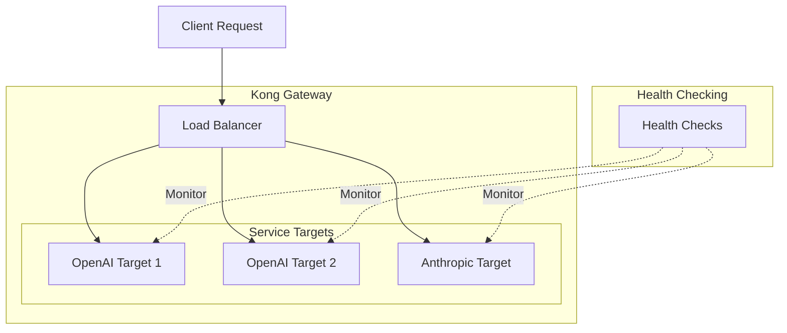

## 7. Security Layers

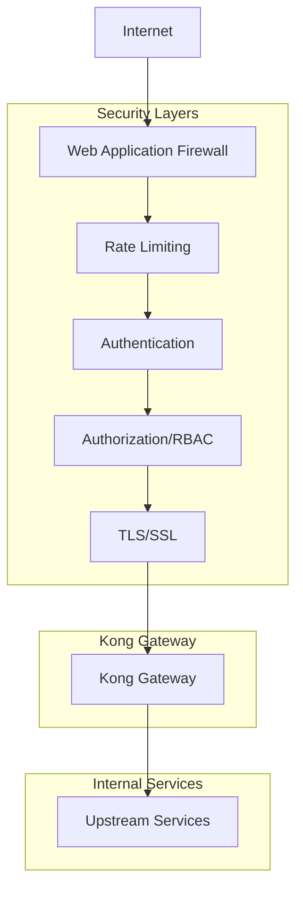

## 8. Monitoring and Observability

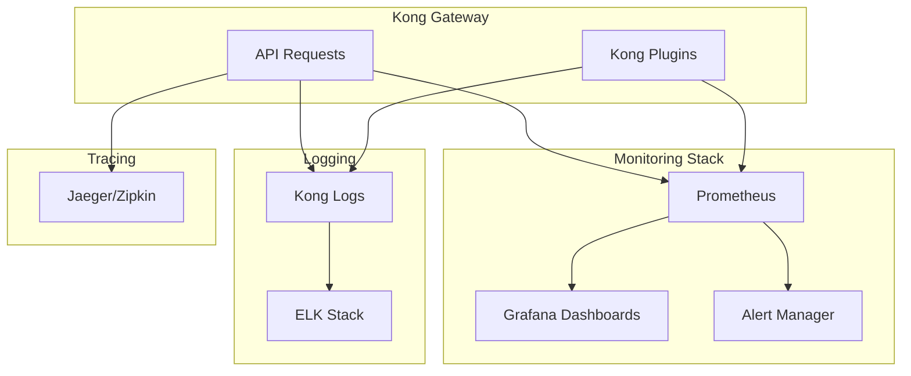

## 9. Development vs Production Setup

```mermaid
graph TB
    subgraph "Development (Your Current Setup)"
        Dev[Developer]
        DevKong[Kong Gateway<br/>No Auth]
        DevAPI[Direct API Access]
        
        Dev -->|Direct Access| DevKong
        DevKong -->|API Keys in Headers| DevAPI
    end
    
    subgraph "Production (Recommended)"
        User[End User]
        CDN[CDN]
        LB[Load Balancer]
        ProdKong[Kong Gateway<br/>+ Auth + Rate Limiting]
        Service[Service Mesh]
        ProdAPI[Protected APIs]
        
        User --> CDN
        CDN --> LB
        LB --> ProdKong
        ProdKong --> Service
        Service --> ProdAPI
    end
    
    style Dev fill:#ffcc99
    style DevKong fill:#ff9999
    style User fill:#99ff99
    style ProdKong fill:#99ff99
```

## 10. Plugin Ecosystem Overview

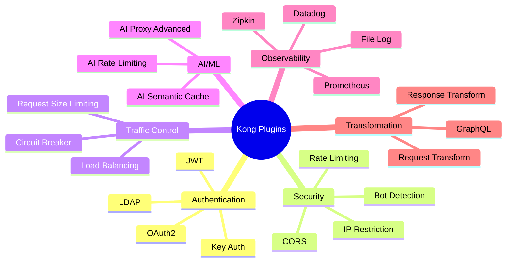

## 11. Your Current vs Ideal Architecture

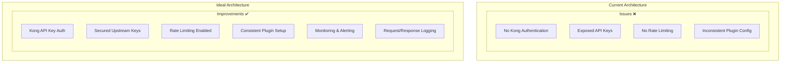

## 12. Kong Gateway Deployment Options

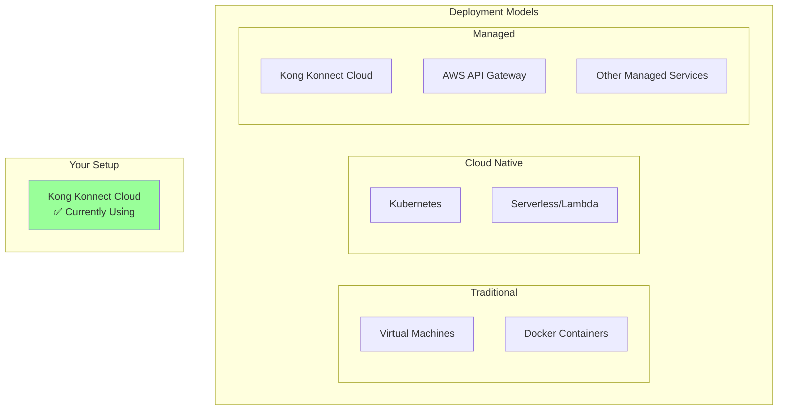

---

## How to Use These Diagrams

1. **Start with Diagram #1** - Understand the basic Kong architecture
2. **Review Diagram #2** - See your current setup
3. **Follow Diagram #3** - Understand request flows
4. **Study Diagram #5** - Learn about security implications
5. **Plan using Diagram #11** - Identify improvements needed

## Next Steps

1. **Immediate**: Fix security issues identified in your current setup
2. **Short-term**: Add proper authentication and rate limiting
3. **Long-term**: Implement monitoring and advanced traffic management

These diagrams should help you visualize how Kong works and how to improve your current setup!